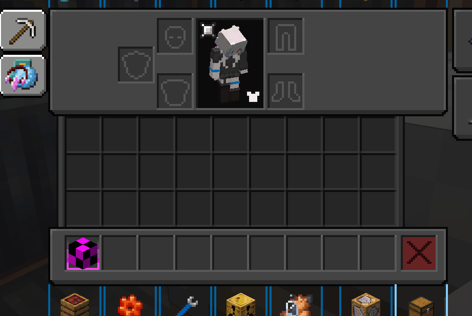

# 前言

> 什么是 Ponder ?

为物品创建沉浸式场景，让玩家更容易理解其用途及细枝末节

<details>
  <summary>目录（单击展开）</summary>

- [前言](#前言)
- [开始之前](#开始之前)
1. [正式开始](#正式开始)
2. [准备阶段](#准备阶段)
3. [显示地板](#显示地板)
4. [适当的等待](#适当的等待)
5. [放置方块](#放置方块)
6. [显示方块](#显示方块)
7. [文本显示](#文本显示)
8. [包边](#包边)

</details>

# 开始之前

Ciallo ～(∠·ω< )⌒☆ 这里是**柒星月**～，你也可以叫我**柒月**，那么在开始之前呢，我们先来看一段完整的 `Ponder` 演示，以方便了解一下 `Ponder` 究竟可以做什么。  
  
可以看到 `Ponder` 除了 `Create` 自带的用法外，我们还可以使用它制作出 `Modpack` 内某些`多方块结构`以及`世界合成`等涉及到多个方块的工作方式。

# 正式开始

> 脚本目录位于 `客户端/kubejs/client_scripts`
>
> 在此文件内的任意地方都可以，但是更建议在 `client_scripts` 内创建一个 `Ponder` 文件夹，将你的 Ponder 脚本丢进去，而 Ponder 文件夹内还可以套文件夹用于进一步的整理与分类，养成分类的好习惯，会让你的编写更加方便（注意一下我的目录）
> 

和其他的 KubeJS 脚本一样，开头都应该先声明事件，所有的编写都在 `{}` 内进行，毕竟都是 JS 的扩展。

```js
Ponder.registry((e) => { });
```

# 准备阶段

首先，你需要一个 `.nbt` 文件  
可以用机械动力的`蓝图与笔`或者原版的`结构方块`获取 NBT 的结构（这俩自己去学习用法，本教程并不会提及）  
**这边提一个至关重要的点，如果你想要获取的结构仅仅只是一个地板，并且想要在这个地板的基础上做出很多 Ponder 的话，那地板上面所预留的空气方块也一样要足！如果没有足够的空气方块那么普通方块也不会正常的显示！**  
  
**最推荐的就是像上图这样直接搞一个正方形的结构，包括空气方块！**  
在获取一个完整的 nbt 结构文件时，最好把地板也一起搭建并打包好  
可以打开 Ponder 的开发者模式，用于显示坐标（限制存档，新存档需要再次开启）  
  
开启开发者模式后便可查看各个方块的坐标  


> 将 nbt 文件存储在 `客户端/kubejs/assets/kubejs/ponder/`

在脚本中插入以下内容:

```js
Ponder.registry((event) => {
  event.create("kubejs:submarine_core") // 填入需要添加 Ponder 的 Item，填入多个 Item 时要用 [ ] 包裹，同时也可以使用Tag
    .scene(
      "kubejs:submarine", // Ponder ID
      "潜水艇 ", // 侧边显示的标题
      "kubejs:submarine", // 读取的结构文件名称，可于assets/ponder/自行下载
      (scene, utils) => {}
    );
});
```

根据我们自己搭建的结构，以及 Ponder 场景中的地板坐标，大致推算出各个方块的位置
（别在意我这个铜块生锈，忘记用涂蜡的铜块了 QwQ）


注意：

- 离你最近的地板方块的坐标是 `[0, 0, 0]`，往`左`、`上`、`右`分别对应 `x, y, z`

# 显示地板

> 在最开始，我们需要显示部分的结构（例如地板），你有一些选择，在 `{}` 内输入

```js
// 显示读取的nbt文件中，y = 0 的部分
scene.showBasePlate();
// 显示读取的nbt文件中，y = 0 ~ n 的部分，也可不填参数，那个场合将整个nbt文件的结构显示
scene.showStructure(n);
```

> showBasePlate() 和 showStructure(0) 完全相等

# 适当的等待

> 显示完底盘直接开始动画你可能会觉得稍显快速，此时你可以使用

```js
// 等待 20 Tick
scene.idle(20);
// 等待 1 秒
scene.idleSeconds(1);
```

> 20 Tick = 1 秒，关于 Tick 更多信息可以到 👉[刻#游戏刻与计算速率 @ Minecraft 中文 wiki](https://zh.minecraft.wiki/w/刻#游戏刻与计算速率)👈 进行查看，这里不做过多的赘述

`该停顿的地方就停顿，该换行的地方就换行，该缩进的地方就缩进，不要为了贪图快捷而把该有的东西给漏了.要记住你做出来的东西是给人看的，以后痛苦的是自己，一定要养成好习惯!`

> Erhai_lake 温馨提示：
>
> 代码如诗行千里路，规范编程点滴成风华；  
> 技术路漫漫修行难，规范编码莫欠债；  
> 欠技术债一时爽，还债还千年；  
> 不把规范当玩笑，造福接手的程序员。  
>
> 清晰注释似流水，变量命名如春风；  
> 逻辑严密如古琴，Bug 修复似绣花；  
> 代码洁净如明镜，函数单一如画框；  
> 重构不停如江水，测试全面如明镜。  
>
> 持续集成如黄金，部署自动如飞翔；  
> 技术债务莫留下，规范编码当立志；  
> 传承优良编程风，后人称赞无忧愁。  
>
> 诗词大意：将编程与诗歌相提并论，强调了规范编程的重要性，在编程道路上，遵循规范就如同写诗一样，需要点滴积累，同时强调了一下技术之路的艰辛和规范编码的必要性，警示不要欠下技术债务，否则将来还债将是漫长的过程（甚至还不起），最后强调了规范编码的价值，不仅可以造福当前的程序员，也能为后人留下优良的编程风格。

此时你的代码应该如下面所示

```js
Ponder.registry((event) => {
  event.create("kubejs:submarine_core").scene(
    "kubejs:submarine",
    "潜水艇",
    "kubejs:submarine",
    (scene, utils) => {
      // 显示底盘，同时等待 20 Tick
      scene.showBasePlate();
      scene.idle(20);
    }
  );
});
```

# 放置方块

> 下一步，我们想要把鼓风机显示出来，根据上图的结构我们得知右边的鼓风机的位置在 `[2,　1,　1]`，那我们接着写

```js
// 在 [2, 1, 2] 放置鼓风机方块，若该位置原本有方块，则破坏该原本方块，默认是 true，可写可不写
scene.world.setBlocks([2, 1, 1], "create:encased_fan", true);

// 同上，但是不显示破坏方块时的粒子效果
scene.world.setBlocks([2, 1, 1], "create:encased_fan", false);
```

# 显示方块

仅仅放置方块并不够，你还需要将它显示出来

```js
// 以从上面下落到坐标 [2, 1, 1] 的动画形式显示出这一格的方块
scene.world.showSection([2, 1, 1], Direction.down);
```

如果我们想要显示某区域的方块可以直接写

```js
scene.world.showSection([3, 1, 1, 1, 1, 3], Direction.down);
```

这样以 `[3, 1, 1]` 及 `[1, 1, 3]` 为对角组成的`矩形区域内`的方块全部都会以下落的方式展现出来  
同时上面的`setBlocks`也可以通过这样的方式以达到快速放置方块的效果

若是某格方块是`已显示状态`，此时在该格放置方块时，该方块会直接显示出来，不必再显示一次。  
例如: 使用 `showStructure(n)` 时，y = 0 ~ n 的个格子全部变为`已显示状态`，即使是空气方块。

# 文本显示

文本显示很简单，这里我不会讲的特别详细（因为也没东西可以讲…）

文本显示有两种，第一种是这种从某个坐标延伸出来的文本框  


```js
// 40是时间，由Tick进行控制
scene.text(40, "文本", [4.5, 3.5, 2]);
```

第二种则是直接在右上角显示的文本框  


```js
// 和上面一样，30是显示的时间，由Tick进行控制
scene.text(30, "文本");
```

> 根据对 Minecraft 的了解，在文本前输入不同的代码可以使其呈现出不一样的效果，例如加粗以及图中的蓝色文本  
> 具体请到 👉[Minecraft wiki](https://zh.minecraft.wiki/w/格式化代码#颜色代码)👈 进行查看

# 包边

和文本显示一样，都没什么可以讲的，所以挺短的  


```js
/*
red 不用我多说也知道是什么意思，但是Ponder场景自身似乎支持的颜色并不多  
坐标的选取可以和上面的一样直接选择一个区域，就如同图里的一样
*/
scene.overlay.showOutline("red", {}, [7, 1, 3, 3, 5, 7], 30);
```
