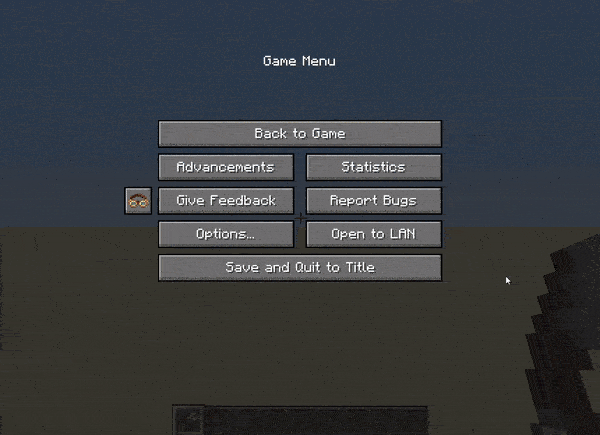

# 前言

> 什么是 Ponder ?

为物品创建沉浸式场景, 让玩家更容易理解其用途及细枝末节

<details>
  <summary>目录（单击展开）</summary>
  <ol>
    <li><a href="#前言">前言</a> </li>
    <li><a href="#开始之前">开始之前</a></li>
    <li><a href="#正式开始">开始</a></li>
    <li><a href="#准备阶段">准备阶段</a></li>
    <li><a href="#显示地板">显示地板</a></li>
    <li><a href="#适当的等待">适当的等待</a></li>
	<li><a href="#关键帧">关键帧</a></li>
    <li><a href="#放置方块">放置方块</a></li>
    <li><a href="#显示方块">显示方块</a></li>
    <li><a href="#文本显示">文本显示</a></li>
    <li><a href="#包边">包边</a></li>
	<li><a href="#操作交互">交互操作(左右键)</a></li>
  </ol>
</details>

# 开始之前

Ciallo ～(∠·ω< )⌒☆ 这里是**柒星月**~, 你也可以叫我**柒月**, 那么在开始之前呢, 我们先来看一段完整的`Ponder`演示, 以方便了解一下`Ponder`究竟可以做什么


> 具体代码详见[Submarine](kubejs/client_scripts/Ponder/Submarine.js)
> nbt 文件在[NBT](kubejs/assets/ponder/submarine.nbt)

可以看到`Ponder`除了`Create`自带的用法外, 我们还可以使用它制作出`Modpack`内某些`多方块结构`以及`世界合成`等涉及到多个方块的工作方式

# 正式开始

> 脚本目录位于 `客户端/kubejs/client_scripts`
>
> 在此文件内的任意地方都可以, 但是更建议在 `client_scripts` 内创建一个 `Ponder` 文件夹, 将你的 Ponder 脚本丢进去, 而 `Ponder` 文件夹内还可以套文件夹用于进一步的整理与分类, 养成分类的好习惯, 会让你的编写更加方便(注意一下我的目录)
> 

和其他的 KubeJS 脚本一样, 开头都应该先声明事件, 所有的编写都在 `{}` 内进行, 毕竟都是 `JavaScript` 的扩展

```js
Ponder.registry((e) => {});
```

# 准备阶段

首先, 你需要一个 `.nbt` 文件

可以用机械动力的[蓝图与笔](https://www.mcmod.cn/item/347848.html)或者原版的[结构方块](https://www.mcmod.cn/item/35469.html)获取 NBT 的结构(这俩自己去学习用法, 本教程并不会提及)

**这边提一个至关重要的点, 如果你想要获取的结构仅仅只是一个地板, 并且想要在这个地板的基础上做出很多 Ponder 的话, 那地板上面所预留的空气方块也一样要足够!如果没有足够的空气方块那么普通方块也不会正常的显示!**


**最推荐的就是像上图这样直接搞一个正方形的结构,包括空气方块!**
在获取一个完整的 nbt 结构文件时,最好把地板也一起搭建并打包好

可以打开 Ponder 的开发者模式,用于显示坐标(限制存档, 新存档需要再次开启)



开启开发者模式后便可查看各个方块的坐标


> 将 nbt 文件存储在 `客户端/kubejs/assets/kubejs/ponder/`

在脚本中插入以下内容:

```js
Ponder.registry((e) => {
  e.create("kubejs:submarine_core") // 填入需要添加 Ponder 的 Item,填入多个 Item 时要用 [ ] 包裹,同时也可以使用Tag
    .scene(
      "kubejs:submarine", // Ponder ID
      "潜水艇 ", // 侧边显示的标题
      "kubejs:submarine", // 读取的结构文件名称,可于assets/ponder/自行下载
      (scene, utils) => {}
    );
});
```

根据我们自己搭建的结构,以及 Ponder 场景中的地板坐标,大致推算出各个方块的位置
(别在意我这个铜块生锈,忘记用涂蜡的铜块了 QwQ)


注意:

- 离你最近的地板方块的坐标是`[0,0,0]`,往`左`,`上`,`右`分别对应 `x,y,z`

# 配置地板

> 这是机械动力作者用来直接创建地板的方法

```js
// 其三个参数分别用于配置: X轴偏移, Z轴偏移以及地板大小
scene.configureBasePlate(xOffset, zOffset, basePlateSize)
```

# 显示地板

> 在最开始,我们需要显示部分的结构(例如地板),你有一些选择,在 `{}` 内输入

```js
// 显示读取的nbt文件中,y = 0 的部分
scene.showBasePlate();
// 显示读取的nbt文件中,y = 0 ~ n 的部分,也可不填参数,那个场合将整个nbt文件的结构显示
scene.showStructure(n);
```

> showBasePlate() 和 showStructure(0) 完全相等

# 适当的等待

> 显示完底盘直接开始动画你可能会觉得稍显快速,此时你可以使用

```js
// 等待 20 Tick
scene.idle(20);
// 等待 1 秒
scene.idleSeconds(1);
```

> 20 Tick = 1 秒,关于 Tick 更多信息可以到 👉[Minecraft 中文 wiki](https://zh.minecraft.wiki/w/刻?variant=zh-cn)👈 进行查看,这里不做过多的赘述

`该停顿的地方就停顿,该换行的地方就换行,该缩进的地方就缩进,不要为了贪图快捷而把该有的东西给漏了.要记住你做出来的东西是给人看的,以后痛苦的是自己,一定要养成好习惯!`

> Erhai_lake 温馨提示:
>
> 代码如诗行千里路,规范编程点滴成风华.
> 
> 技术路漫漫修行难,规范编码莫欠债.
> 
> 欠技术债一时爽,还债还千年.
> 
> 不把规范当玩笑,造福接手的程序员.
>
> 清晰注释似流水,变量命名如春风.
> 
> 逻辑严密如古琴,Bug 修复似绣花.
> 
> 代码洁净如明镜,函数单一如画框.
> 
> 重构不停如江水,测试全面如明镜.
>
> 持续集成如黄金,部署自动如飞翔.
> 
> 技术债务莫留下,规范编码当立志.
> 
> 传承优良编程风,后人称赞无忧愁.
>
> 诗词大意:将编程与诗歌相提并论,强调了规范编程的重要性,在编程道路上,遵循规范就如同写诗一样,需要点滴积累,同时强调了一下技术之路的艰辛和规范编码的必要性,
> 警示不要欠下技术债务,否则将来还债将是漫长的过程(甚至还不起),最后强调了规范编码的价值,不仅可以造福当前的程序员,也能为后人留下优良的编程风格.

此时你的代码应该如下面所示

```js
Ponder.registry((e) => {
  e.create("kubejs:submarine_core").scene(
    "kubejs:submarine",
    "潜水艇",
    "kubejs:submarine",
    (scene, utils) => {
      // 显示底盘,同时等待 20 Tick
      scene.showBasePlate();
      scene.idle(20);
    }
  );
});
```

# 关键帧

在 Ponder 场景的演示动画中,我们难免会遇见动画太长而我们只看某一段的场面,Ponder 却不想视频那样可以直接拖动进度条,但是却有一个接近的东西,在某些关键的地方创建一个个的跳转点


```js
// 在 当前 tick 创造一个关键帧
scene.addKeyframe();

// 在 5 Tick 后(当前tick往后数的第六个tick)创造一个关键帧
scene.addLazyKeyframe();
```

经过测试

```js
// 连续2个 addKeyframe 只会创造一个关键帧
scene.addKeyframe();
scene.addKeyframe();

// 如此则会创造两个关键帧, 其间隔 5 Tick
scene.addKeyframe();
scene.addLazyKeyframe();
```

# 放置方块

> 下一步,我们想要把鼓风机显示出来,根据上图的结构我们得知右边的鼓风机的位置在 `[2,1,1]`,那我们接着写

```js
// 在[2,1,2]放置鼓风机方块,若该位置原本有方块,则破坏该原本方块
scene.world.setBlocks([2, 1, 1], "create:encased_fan");

// 同上, 若第三个参数为 false 则不显示破坏方块时的粒子效果
scene.world.setBlocks([2, 1, 1], "create:encased_fan", true);
```

> 值得一提的是, 后两个参数似乎是可以对调的, 即
>
> scene.world.setBlocks([2, 1, 1], "create:encased_fan", false); = scene.world.setBlocks([2, 1, 1], false, "create:encased_fan");

# 显示方块

仅仅放置方块并不够,你还需要将它显示出来

```js
// 以从上面下落到坐标 [2,1,1] 的动画形式显示出这一格的方块
scene.world.showSection([2, 1, 1], Direction.down);
```

如果我们想要显示某区域的方块可以直接写

```js
scene.world.showSection([3, 1, 1, 1, 1, 3], Direction.down);
```

这样以 `[3,1,1]` 及 `[1,1,3]` 为对角组成的`矩形区域内`的方块全部都会以下落的方式展现出来

同时上面的`setBlocks`也可以通过这样的方式以达到快速放置方块的效果

若是某格方块是`已显示状态`,此时在该格放置方块时,该方块会直接显示出来,不必再显示一次

例如: 使用 `showStructure(n)` 时,y = 0 ~ n 的个格子全部变为`已显示状态`,即使是空气方块

> ### 注意
>
> - `[3, 1, 1, 1, 1, 3]`同样可以写为`[1, 1, 1, 3, 1, 3]`
> - 并且无论哪种写法,`showSection`动画都将持续15 tick
> - `showSection`方法将会把显示的区域合并到`baseWorldSection`中,即`scene.ponderjs$getPonderScene().baseWorldSection`

## 进阶用法

> ### showIndependentSection
>
> `scene.world.showIndependentSection(selection: Selection, fadeInDirection: Direction): ElementLink<WorldSectionElement>`
>
> 该方法用于显示一个区域,并返回该区域的`ElementLink`(此方法的动画同样持续15 tick)
>
> ```js
> const example_link = scene.world.showIndependentSection([2 ,1 ,2], Direction.down);
>  ```

> ### showIndependentSection
>
> `scene.world.showIndependentSection(selection: Selection, fadeInDirection: Direction, fadeInDuration: number): ElementLink<WorldSectionElement>`
>
> 此方法相较与上面的方法,多了一个`fadeInDuration`参数
> 
> 该参数接受一个整数,用于修改动画持续时间

> ### showIndependentSectionImmediately
>
> `scene.world.showIndependentSectionImmediately(selection: Selection): ElementLink<WorldSectionElement>`
> 
> 此方法是上述两个方法的简化版,作用是立刻显示一个区域,并且返回该区域的`ElementLink`
> 
> 作为简化的代价,该方法的默认`fadeInDirection`为`Direction.down`

> ### showSectionAndMerge
>
> `scene.world.showSectionAndMerge(selection: Selection, fadeInDirection: Direction, link: ElementLink<WorldSectionElement>): void`
>
> 还记得我们刚刚创建的`example_link`吗?
>
> 便是此方法接受的`link`参数
>
> 该方法用于显示一个区域,并将显示的区域合并到`link`中(此方法的动画同样持续15 tick)

> ### glueBlockOnto
>
> `scene.world.glueBlockOnto(blockPos: BlockPos, fadeInDirection: Direction, link: ElementLink<WorldSectionElement>): void`
>
> 这个方法是为了方便Java开发者而写的
>
> 在JavaScript中,它与上述方法的区别仅有第一个参数:
> - 该方法只能传入一个方块坐标
> - 而上述方法支持一个方块坐标或一个区域

# 文本显示

文本显示很简单,这里我不会讲的特别详细(因为也没东西可以讲...)

文本显示有两种,第一种是这种从某个坐标延伸出来的文本框


```js
// 显示 40 Tick "文本"
scene.text(40, "文本", [4.5, 3.5, 2]);
```

第二种则是直接在右上角显示的文本框


```js
//  显示 30 Tick "文本"
scene.text(30, "文本");
```

结合上文的关键帧知识点,我们也可以在文本处直接创建一个关键帧

```js
scene.text(30, "文本").attachKeyFrame();
```

> 根据对 Minecraft 的了解,在文本前输入不同的代码可以使其呈现出不一样的效果,例如加粗以及图中的蓝色文本
> 具体请到 👉[Minecraft wiki](https://zh.minecraft.wiki/w/格式化代码?variant=zh-cn#颜色代码)👈 进行查看

# 包边

和文本显示一样,都没什么可以讲的,所以挺短的


```js
/*
red不用我多说也知道是什么意思,但是Ponder场景自身似乎支持的颜色并不多
坐标的选取可以和上面的一样直接选择一个区域,就如同图里的一样
*/
scene.overlay.showOutline("red", {}, [7, 1, 3, 3, 5, 7], 30);
```

# 操作交互

这种就是典型的一种右键操作示例图


交互显示并不会帮你实现任何操作,他能做的仅仅只有显示一个小框框在你的屏幕上,告诉看的人"这里的交互方式是左键亦或是右键",想要显示需要额外的操作,这里就是最基础的连接的开始了,先来看一段 GIF

.gif>)

这里就很经典的运用了两个知识点,`右键`和`替换方块`,我们先看看`右键`的代码

```js
scene
  .showControls(30, [3, 1, 5], "left") // 在 [3, 1, 5] 的右方创建一个向左指的框, 时长为 30 Tick
  .rightClick() // 在框内显示 鼠标右键 的图示
  .withItem("immersiveengineering:hammer"); // 在框内显示 "immersiveengineering:hammer" 的图示
```

没错,就这么简单.一行行拆开来看也是非常的简单易懂

如果搭配上`方块替换`来看,整串的代码就是这样

```js
// 在 [2, 1, 2] 的上方创建一个向下指的框, 时长为 80 Tick, 框内显示 鼠标右键 及 "kubejs:sturdy_sheet_block"
scene
  .showControls(80, [2, 1, 2], "down")
  .rightClick()
  .withItem("kubejs:sturdy_sheet_block");

// 替换方块
scene.world.setBlocks([2, 1, 2], "mekanism:cardboard_box");
```

> 此处额外列举其他接在 showControls 后面的方法

```js
scene.showControls(80, [2, 1, 2], "down")
 .clone(); // 暂时不知道功能	
 .scroll(); // 在框内显示 鼠标中键(滚轮) 的图示
 .whileCTRL(); // 在框内显示 CTRL 的图示
 .withWrench(); // 在框内显示 机械动力的扳手 的图示
 .showing(picon); // 在框内显示 picon 对应的的图示, 所有 picon 可于 kubejs/constant/PonderIcons.md 确认
 .leftClick(); // 在框内显示 鼠标左键 的图示
 .whileSneaking(); // 在框内显示 潜行 的图示
```
[PonderIcons.md跳转连接](https://github.com/Qi-Month/PonderJs-Tutorials/blob/main/kubejs/constant/PonderIcons.md).
