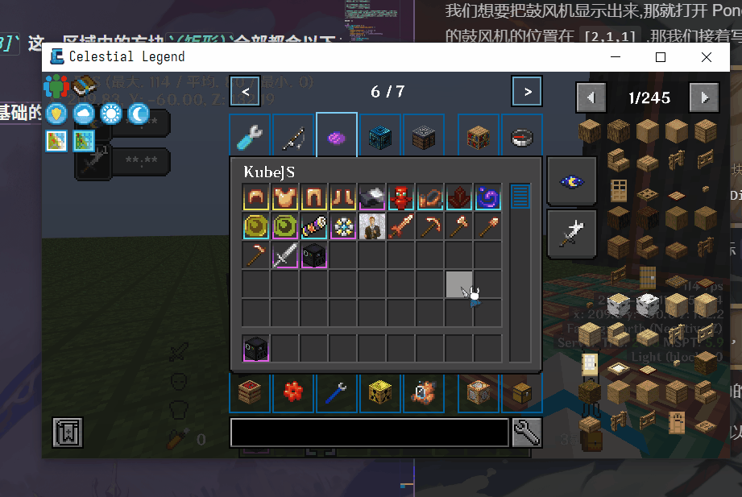

# Ponder

## **☆ Ciallo ～(∠・ω ＜)⌒☆** 这里是**柒星月**~你可以叫我**柒月**哦

## 那么再开始之前呢,我们先来看一段完整的 Ponder


## 开始

> 脚本目录位于 客户端 `/kubejs/client_scripts`
>
> 在此文件内的任意地方都可以,但是更建议在 `client_scripts` 内创建一个 `Ponder` 文件夹,将你的 Ponder 脚本丢进去,而 Ponder 文件夹内还可以套文件夹用于进一步的整理与分类,养成分类的好习惯,会让你的编写更加方便(注意一下我的目录)
> 

和其他的 KubeJS 脚本一样,开头都应该先声明事件,所有的编写都在 `{}` 内进行,毕竟都是 Js 的扩展

```js
Ponder.registry((e) => {});
```

第一种(读取.nbt 文件进行编写)

> nbt 文件存储在 客户端 `/kubejs/assets/kubejs/ponder`

可以用 `Create Mod` 的蓝图与笔或者原版的结构方块获取 NBT 的结构(这俩自己学习用法,本教程并不会提及)

在获取一个完整的 nbt 结构文件时,最好把地板也一起搭建并打包好

可以打开 Ponder 的开发者模式,用于显示坐标(限制存档,新存档需要再次开启)


开启开发者模式后便可查看各个方块的坐标


## 准备阶段

在脚本中插入以下内容:

```js
Ponder.registry((e) => {
  e.create("kubejs:submarine_core") //
    .scene(
      "kubejs:submarine", // Ponder ID
      "潜水艇 ", // 侧边显示的标题
      "kubejs:submarine", // 读取的结构文件名称
      (scene, utils) => {}
    );
});
```

根据我们自己搭建的结构,以及 Ponder 场景中的地板坐标,大致推算出各个方块的位置(别在意我这个铜块生锈,忘记用涂蜡的铜块了 QwQ)


注意:

- 你地板的坐标 Y 轴是 0,所以要从 1 开始算

先让方块显示出来,我们在得先让地板显示出来,在 `{}` 内输入

```js
scene.showBasePlate();
scene.idle(20);
```

这里提一嘴: 在 Ponder 中 `scene.idle(20);` 的作用是停顿,例如显示完底盘等 1s 再继续显示,就写上这个,时间单位是`Tick` ,在 Minecraft 中 1Tick = 0.05s,因此停顿一秒就是 20Tick,关于 Tick 的更多信息可以到 [Minecraft Wiki](https://zh.minecraft.wiki/w/%E5%88%BB) 进行查看,这里不做过多的赘述

该停顿的地方就换行的地方就换行,该缩进的地方就缩进,不要为了贪图快捷而把该有的东西给漏了,要记住你做出来的东西是给人看的,以后痛苦的是自己,一定要养成好习惯!

> Erhai_lake 温馨提示:
>
> 代码如诗行千里路,规范编程点滴成风华.
> 技术路漫漫修行难,规范编码莫欠债.
> 欠技术债一时爽,还债还千年.
> 不把规范当玩笑,造福接手的程序员.
>
> 清晰注释似流水,变量命名如春风.
> 逻辑严密如古琴,Bug 修复似绣花.
> 代码洁净如明镜,函数单一如画框.
> 重构不停如江水,测试全面如明镜.
>
> 持续集成如黄金,部署自动如飞翔.
> 技术债务莫留下,规范编码当立志.
> 传承优良编程风,后人称赞无忧愁.
>
> 诗词大意:将编程与诗歌相提并论,强调了规范编程的重要性,在编程道路上,遵循规范就如同写诗一样,需要点滴积累,同时强调了一下技术之路的艰辛和规范编码的必要性,警示不要欠下技术债务,否则将来还债将是漫长的过程(甚至还不起),最后强调了规范编码的价值,不仅可以造福当前的程序员,也能为后人留下优良的编程风格.

如下面所示

```js
Ponder.registry((e) => {
  e.create("kubejs:submarine_core") //
    .scene(
      "kubejs:submarine", // Ponder ID
      "潜水艇 ", // 侧边显示的标题
      "kubejs:submarine", // 读取的结构文件名称
      (scene, utils) => {
        // 显示底盘
        scene.showBasePlate();
        scene.idle(20);
      }
    );
});
```

我们想要把鼓风机显示出来,那就打开 Ponder 场景以及看你的结构,根据信息我们得知右边的鼓风机的位置在 `[2,1,1]` ,那我们接着写

```js
// 显示底盘,同时停顿1秒钟
scene.showBasePlate();
scene.idle(20);
// 由动画的形式显示坐标为[2,1,1]的方块
scene.world.showSection([2, 1, 1], Direction.down);
```

这一段的代码是以动画从上面下落到坐标 `[2,1,1]` 的形式显示出这一格的方块,如果我们想要显示某区域的方块可以直接写

```js
scene.world.showSection([3, 1, 1, 1, 1, 3], Direction.down);
```

这样从 `[3,1,1]` 到 `[1,1,3]` 这一区域内的方块`(矩形)`全部都会以下落的方式展现出来

如果你有一定的`JavaScript`基础的话,可以稍微偷一下懒,做出这样一个个显示的效果.那么这里就不做过多赘述,仅仅只是给有一定`JavaScript`参考用的


```js
const blocks_1 = [
  [5, 1, 5],
  [4, 1, 5],
  [3, 1, 5],
  [5, 1, 4],
  [4, 1, 4],
  [3, 1, 4],
  [6, 1, 3],
  [5, 1, 3],
  [3, 1, 3],
  [2, 1, 3],
  [6, 1, 2],
  [5, 1, 2],
  [4, 1, 2],
  [3, 1, 2],
  [2, 1, 2],
];
for (let block of blocks_1) {
  scene.world.showSection(block, Direction.down);
  scene.idle(2);
}
scene.world.showSection([4, 1, 3], Direction.down);
scene.idle(20);
```

## 文本显示(这俩挺简单的,就让我偷个懒吧,不想搭建个新的 😭)

嗯...文本显示有两种,第一种是这种一条线从某坐标延伸出来的


```js
// 40是时间,也是游戏刻哦
scene.text(40, "文本", [4.5, 3.5, 2]);
```

根据对 Minecraft 游戏的理解,我们可以通过颜色代码对文本的颜色进行控制,就好像图片中的是蓝色一样,具体可以在 👉[WIKI](https://zh.minecraft.wiki/w/格式化代码?variant=zh-cn#颜色代码)👈 进行查看

第二种..就是这种在右上角显示的..嗯..(●'◡'●)


```js
// 30也是时间...
scene.text(30, "§b用工程师锤右击正前方的铝板金属");
```

**很简单对叭...嗯...别看着我...快点继续啦!**

## 包边

不说那么多,直接上图!


```js
/* 
green不用我多说了!唯一要注意的是游戏内颜色似乎没你想象的那么多
至于坐标,可以和显示方块一样,直接像图内一样直接显示一个巨大的矩形,嗯最后的30不用说也知道是时间了
*/
scene.overlay.showOutline("green", {}, [3, 1, 5], 30);
```
