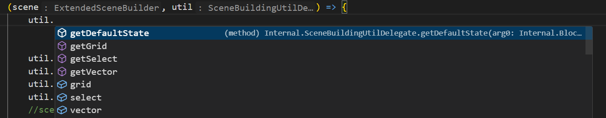

# 实用工具

>   您可能需要了解一些基础知识和基本概念来愉快的编写 PonderJS, 同时您也可能需要一些实用工具来加速思索场景的构建一类.


## Ponder场景是什么

Ponder场景并不是一个小世界/维度! 它只是一个支持一些属性的场景渲染器.

里面的方块实体,普通实体并不会被tick,多状态贴图动画也不会自动更新.

也就是说工作盆自动输出物品,方块状态贴图更新,实体交互动画一类都得你来自己写x


以下程序片段截自forge机械动力官方源码`Create/src/main/java/com/simibubi/create/infrastructure/ponder/scenes
/ProcessingScenes.java`(思索 使用辊压机打包物品):

```java
BlockPos basin = util.grid.at(1, 2, 2);
        BlockPos pressPos = util.grid.at(1, 4, 2);                        //辊压机位置
        Vec3 basinSide = util.vector.blockSurface(basin, Direction.WEST); //工作盆侧面

        ItemStack copper = new ItemStack(Items.COPPER_INGOT);             //铜物品
        ItemStack copperBlock = new ItemStack(Items.COPPER_BLOCK);        //铜块物品

        scene.overlay.showText(60)
            .pointAt(basinSide)
            .placeNearTarget()
            .attachKeyFrame()
            .text("Pressing items held in a Basin will cause them to be Compacted");
        scene.idle(40);

        scene.overlay.showControls(new InputWindowElement(util.vector.topOf(basin), Pointing.DOWN).withItem(copper),
            30);
        scene.idle(30);
        Class<MechanicalPressBlockEntity> type = MechanicalPressBlockEntity.class;
        scene.world.modifyBlockEntity(pressPos, type, pte -> pte.getPressingBehaviour()
            .start(Mode.BASIN));     //开始辊压
        scene.idle(30);    //等待辊压动画(是的,只能这样等,没有别的方法！)
        scene.world.modifyBlockEntity(pressPos, type, pte -> pte.getPressingBehaviour()
            .makeCompactingParticleEffect(util.vector.centerOf(basin), copper));    //生成辊压粒子效果
        scene.world.modifyBlockEntityNBT(util.select.position(basin), BasinBlockEntity.class, nbt -> {
            nbt.put("VisualizedItems",
                NBTHelper.writeCompoundList(ImmutableList.of(IntAttached.with(1, copperBlock)), ia -> ia.getValue()
                    .serializeNBT()));
        });    //给工作盆追加VisualizedItems nbt tag,从而产生物品输出动画
        scene.idle(4);    //等待物品下落动画(是的,只能这样等,没有别的方法！)
        scene.world.createItemOnBelt(util.grid.at(1, 1, 1), Direction.UP, copperBlock);//在传送带上生成"落"在上面的工作盆输出物品
        scene.idle(30);
```

可以看到,在思索中并不会和平时一样放好机器,接入动力,工作盆放入物品就会自动加工.一切动画/事件都是手动实现的x

自然我们使用ponderjs也只能手动实现动画：

```javascript
onEvent("ponder.registry", (event) => {
    event.create("minecraft:raw_iron_block") //粗铁块
        .scene(
            "potato_raw_block_scene",
            "土豆和粗铁块......",
            "kubejs:potato_raw_block_scene",
            (scene, util) => {
                const $BasinBlockEntity = java('com.simibubi.create.content.processing.basin.BasinBlockEntity');
                const $MechanicalPressBlockEntity = java('com.simibubi.create.content.kinetics.press.MechanicalPressBlockEntity');
                const $PressingBehaviour = java('com.simibubi.create.content.kinetics.press.PressingBehaviour');
                var depot = util.grid.at(1, 0, 0);
                var basin = util.grid.at(1, 1, 1);
                var press = util.grid.at(1, 3, 1);
                scene.world.setFilterData(basin, $BasinBlockEntity, Item.of("minecraft:air"));
                scene.world.modifyBlock(basin, state = state.with("facing", "down"), false);//实际上工作盆输出口的位置对应方块状态里的朝向
                scene.world.showSection(basin, Direction.UP);
                scene.idle(20);
                scene.overlay.showoutline(PonderPalette.GREEN, new Object(), basin, 30);
                scene.overlay.showFilterslotInput(util.vector.of(1.5, 1.75, 1), Direction.NORTH, 30);
                scene.idle(20);
                scene.world.setFilterData(basin, $BasinBlockEntity, Item.of("minecraft:raw_iron_block"));
                scene.idle(40);
                scene.addKeyframe();
                let potato = scene.world.createItemEntity([1.5, 2.5, 1.5], [0, 0, 0], "9x potato");
                scene.idle(7);
                scene.world.modifyEntity(potato, e => { e.kill(); });//落到工作盆里后 把掉落物清除
                scene.idle(40);
                scene.world.setkineticSpeed(press, 64);
                scene.world.showSection(press, Direction.DOWN);
                scene.world.showSection(depot, Direction.SOUTH);
                scene.idle(15);
                scene.world.modifyBlock(basin, state = state.with("facing", "north"), false);
                scene.addKeyframe();
                scene.world.modifyBlockEntity(press, $MechanicalPressBlockEntity, pte => { pte.getPressingBehaviour().start($PressingBehaviour.Mode.BASIN); })
                scene.idle(13);
                //这边在1182试图追加nbt失败了 就用了创建掉落物的笨方法x
                let raw_iron_block = scene.world.createItemEntity(util.vector.centerof(basin), [0, -0.2, -0.25], "raw_iron_block");
                scene.idle(5);
                scene.world.modifyEntity(raw_iron_block, e => { e.kill(); });//落到置物台上后 把掉落物清除
                scene.world.createItemOnBeltLike(depot, Direction.UP, "raw_iron_block");//在置物台上生成"落"在上面的工作盆输出物品
                scene.idle(10);
            }
        );
});
```

## 一个效果应该怎样实现

首先,思索系统是机械动力自己为了解释自己的系统而设计的,所以官方思索里没出现过的功能 大概率是不可能在思索里实现的(x

不过这也带来了一个很好的思路：

>  想要实现某个效果 先找到官方思索里实现了这个效果的场景
> 
> 随后在[官方源码](https://github.com/Creators-of-Create/Create/blob/mc1.18/dev/src/main/java/com/simibubi/create/infrastructure/ponder/scenes/)里找到它的具体实现方式
> 
> 最后翻译成js就可以了

别忘了probejs,感到迷惑的时候也可以去翻翻机械动力的官方源码解乏.


## scene utils

    为了轻松的定位/选择场景内容一类,ponder除了scene对象还有个util对象：



util.grid里的方法用来选择某一个位置

util.select用来选择一个区域

util.vector用来选择某个特定向量(如方块的某一面的朝向等)

剩下的内容probe和官方用法应该已经讲的很明白了.


