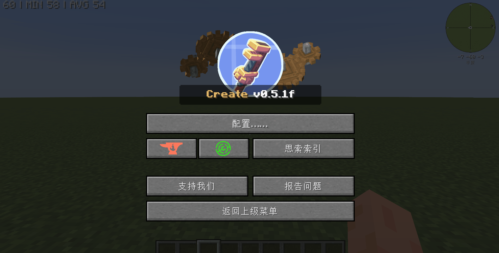

# 前言

> 什么是 PonderTag ?

在思索索引创建分类, 相同分类的 Ponder 也能互相跳转, 是非常方便的功能

<details>
  <summary>目录（单击展开）</summary>
  <ol>
    <li><a href="#前言">前言</a> </li>
    <li><a href="#其一-无中生有">建立新的 PonderTag</a></li>
    <li><a href="#其二-画龙点睛">为已有的 PonderTag 添加新的关联词条</a></li>
    <li><a href="#其三-去芜存菁">删除 PonderTag 内的的关联物品</a></li>
    <li><a href="#其四-一扫而空">删除已有的 PonderTag</a></li>
  </ol>
</details>

# 其一 无中生有

> 建立新的 PonderTag

```js
Ponder.tags((e) => {
  e.createTag(
    "kubejs:iron_golem", // 你设定的PonderTag的id, 必须小写
    "minecraft:iron_ingot", // 你设定的PonderTag的图标
    "铁傀儡", // 你设定的PonderTag的名称
    "铁傀儡是高大强壮的友好生物，用于保护玩家和村民。", // 你设定的PonderTag的介绍
    ["minecraft:iron_block", "minecraft:carved_pumpkin"] // **可选参数** 你设定的PonderTag的关联词条, 只有一个时也能不用 [ ]
  );
});
```



# 其二 画龙点睛

> 为已有的 PonderTag 添加新的关联词条

```js
Ponder.tags((e) => {
  e.add(
    "kubejs:iron_golem", // 要编辑的PonderTag
    ["minecraft:iron_ingot", "minecraft:poppy"] // 要加入的关联词条, 只有一个时也能不用 [ ]
  );
});
```

EX: 建立 Ponder 时一并设置其 PonderTag

```js
Ponder.registry((e) => {
  e.create("minecraft:iron_block")
    .tag("kubejs:iron_golem") // 只能添加已有的PonderTag, 添加复数PonderTag时无须 [ ],  用逗号隔开PonderTag即可
    .scene(
      "minecraft:Iron_Golem",
      "铁傀儡",
      "kubejs:ie_2",
      (scene, utils) => {}
    );
});
```

# 其三 去芜存菁

> 删除 PonderTag 内的的关联物品

```js
Ponder.tags((e) => {
  e.remove(
    "kubejs:iron_golem", // 要编辑的PonderTag
    ["minecraft:iron_ingot", "minecraft:poppy"] // 要删除的关联词条, 只有一个时也能不用 [ ]
  );
});
```

# 其四 一扫而空

> 删除已有的 PonderTag

```js
Ponder.tags((e) => {
  e.removeTag(
    "kubejs:iron_golem" // 要删除的PonderTag, 删除复数PonderTag时无须 [ ],  用逗号隔开PonderTag即可
  );
});
```
